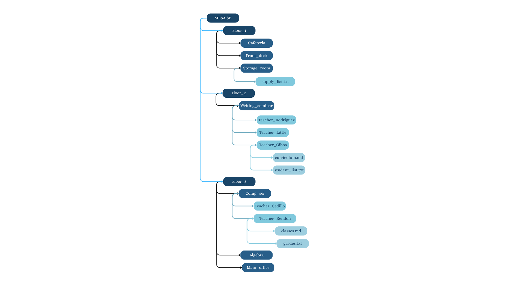

# Project Instructions
Given the following diagram of a folder structure write the commands needed to replicate it. You may click on the following hints if you get stuck!


<details>
  <summary> 
    Hint #1
  </summary>
  In the diagram provided what are the different levels you need to create? Is there a command you can use to build multiple folders at once?
</details>

<details>
  <summary> 
    Hint #2 
  </summary>
  In the diagram provided which of the elements in the directory are folders? Which of them are files?
  What is the command to create a folder? Which is the command to build a file?
</details>

<details>
  <summary> 
    Hint #3 
  </summary>
  
  If there is a __nested__ folder or file what commands would we need to do first to navigate to our holding folder?
  
  A nested folder or file means that the folder or file is within another folder. 
  
  Example of nested folder: 
  
  
  
  In this example `Folder A` is nested within the `Main` folder.
  
</details>

## Task 1: 

```
Write your code in here
```
