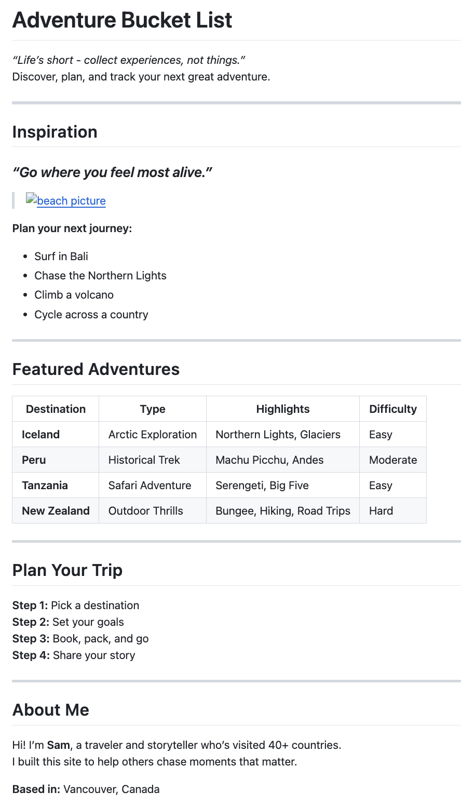

# Project Instructions
Given the following mock-up of a markdown document write the commands needed to replicate it. 

_**Note: You can use the [markdown cheatsheet](https://www.markdownguide.org/cheat-sheet/) to help!**_

---

## Task 2: 

--REMOVE THIS LINE AND WRITE THE CODE FOR YOUR MOCK-UP REPLICA BELOW.--